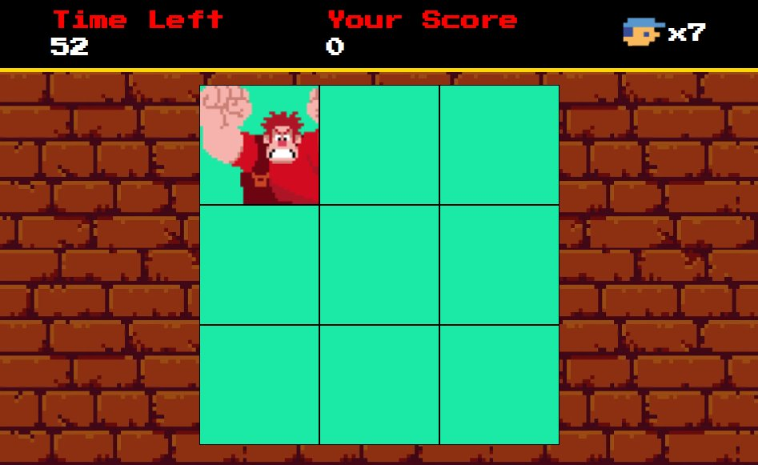

# Detona Ralph Game

A browser-based game inspired by Wreck-It Ralph where players need to hit Ralph when he appears in different squares.

## 🎮 Game Description

In this game, players must click on Ralph when he appears randomly in different squares on the game board. The game features:
- 60-second time limit
- Score tracking
- Lives system (7 lives)
- Sound effects on successful hits

## 🚀 Technologies Used

- HTML
- CSS
- JavaScript

## 🎯 Game Features

- Random square generation for Ralph's appearance
- Real-time score tracking
- Countdown timer
- Lives system
- Sound effects
- Game over condition when time runs out or lives reach zero

## 🎲 How to Play

1. Ralph will randomly appear in different squares
2. Click on Ralph when you see him to score points
3. Missing a click will cost you one life
4. You have 60 seconds to score as many points as possible
5. The game ends when either:
   - Time runs out
   - You lose all 7 lives

## 🛠️ Game Controls

- Use your mouse to click on the squares where Ralph appears
- Left-click to hit Ralph

## 🔧 Setup and Installation

1. Clone this repository
2. Open the index.html file in your browser
3. Start playing!

## 📁 Project Structure
```bash
jogo-detona-ralph/
├── src/
│ ├── audios/
│ │ ├── hit.m4a
│ │ └── miss.m4a
│ └── scripts/
│ └── engine.js
```

## ⚙️ Game Mechanics

- The game runs on a timer that updates every second
- Ralph's position changes every 1000ms
- Sound effects play at 20% volume on successful hits
- Score increases by 1 for each successful hit
- Lives decrease by 1 for each miss

## 🎨 Credits

This game is inspired by Disney's Wreck-It Ralph character and was created for educational purposes.

<br>

<a href='https://maxwelldeveloper7.github.io/jogo-detona-ralph/'>Clique aqui para testar o jogo</a>
<br><br>


# Jogo Detona Ralph

Um jogo baseado em navegador inspirado em Wreck-It Ralph onde os jogadores precisam acertar Ralph quando ele aparece em diferentes quadrados.

## 🎮 Descrição do Jogo

Neste jogo, os jogadores devem clicar em Ralph quando ele aparece aleatoriamente em diferentes quadrados do tabuleiro de jogo. O jogo apresenta:
- Limite de tempo de 60 segundos
- Rastreamento de pontuação
- Sistema de vidas (7 vidas)
- Efeitos sonoros em sucessos de sucesso

## 🚀 Tecnologias Utilizadas

- HTML
- CSS
- JavaScript

## 🎯 Recursos do Jogo

Geração aleatória de janelas para a aparência de Ralph
- Acompanhamento de pontuação em tempo real
- Temporizador de contagem regressiva
- Sistema de vidas
- Efeitos sonoros
- Condição de fim de jogo quando o tempo acaba ou a vida chega a zero

## 🎲 Como Jogar

1. Ralph aparecerá aleatoriamente em janelas diferentes
2. Clique em Ralph ao vê-lo para marcar pontos
3. Perder um clique custará uma vida
4. Você tem 60 segundos para marcar o máximo de pontos possível
5. O jogo termina quando:
   - O tempo acaba
   - Você perde todas as 7 vidas

## 🛠️ Controles do Jogo

- Use o mouse para clicar nas janelas onde Ralph aparece
- Clique com o botão esquerdo para acertar Ralph

## 🔧 Instalação e Configuração

1. Clone este repositório
2. Abra o arquivo index.html em seu navegador
3. Comece a jogar!

## 📁 Estrutura do Projeto
```bash
jogo-detona-ralph/
├── src/
│ ├── audios/
│ │ ├── hit.m4a
│ │ └── miss.m4a
│ └── scripts/
│ └── engine.js
```

## Dinâmica do Jogo

- O jogo funciona com um cronômetro que é atualizado a cada segundo
- A posição de Ralph muda a cada segundo
- Os efeitos sonoros são reproduzidos com volume de 20% em sucessos bem-sucedidos
- A pontuação aumenta em 1 para cada acerto bem-sucedido
- Vidas diminuem em 1 para cada erro

## 🎨 Créditos

Este jogo é inspirado no personagem Wreck-It Ralph da Disney e foi criado para fins educacionais.

